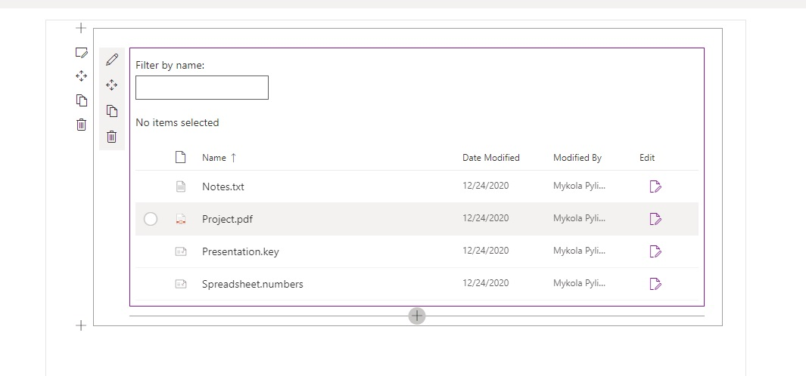
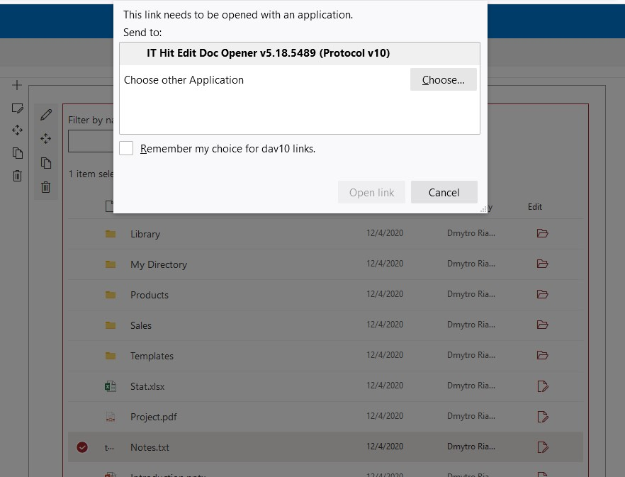

# SharePoint Web Part with Edit Button for non-Microsoft Office Documents Editing

This sample demonstrates a SharePoint web part that displays Edit button for non-MS Office documents. Using this button can open Adobe Acrobat PDF and other non-MS Office documents for editing. To open documents this web part utilizes [SharePointEditDocument()](https://ajax.webdavsystem.com/ITHit.WebDAV.Client.SPSManager.html#SharePointEditDocument) JavaScript function provided with [IT Hit Edit Any Document SDK](https://www.webdavsystem.com/sharepoint/).



See also the [getting started with building web parts on Microsoft website](https://docs.microsoft.com/en-us/sharepoint/dev/spfx/web-parts/get-started/build-a-hello-world-web-part).

Follow the guide below to run the sample.

### Prerequisites
This sample requires [Node.js](https://nodejs.org/) v4+ to run.

### Unzip a sample
Unzip the sample contents to the ITHitSpsWebPart-DetailsList folder.

### Installation
Install the dependencies.

```sh
$ cd ITHitSpsWebPart-DetailsList 
$ npm install
```

### Configure your SharePoint site url
Open **src\webparts\ITHitDetailsList\components\ITHitDetailsList.tsx** and edit **private _listTitle: string** variable. Point it to your SharePoint list title.


### Run the sample
Build and run the sample in the debug mode:

```sh
$ gulp serve
```


### Opening documents for editing
  - Open a SharePoint's hosted workbench from the following URL: https://your-sharepoint-tenant.sharepoint.com/_layouts/workbench.aspx
  - Add web part on the web page. Press + button and select ITHit-DetailsList component.
  - Select the Edit button next to any non-MS Office document to open it for editing. The dialog asking for protocol application installation will appear.
  - Install the protocol application and activate the web browser extension. Find more about the web browser extension activation in [this article](https://www.webdavsystem.com/sharepoint/install/protocol/web_browser_extensions/).
  - Now click the Edit button again. This time the web browser protocol warning dialog will appear. Confirm the document opening. The document will open in the desktop application that is associated with the file extension on the client machine.
    
